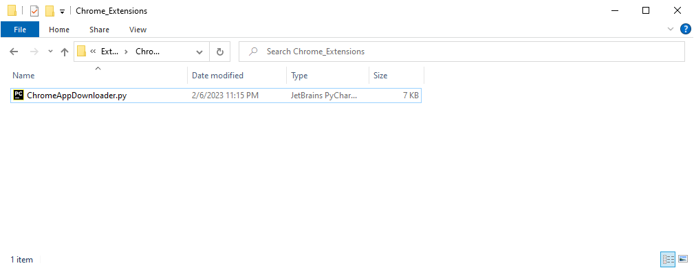
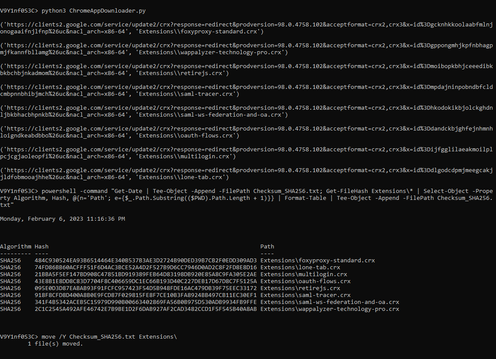
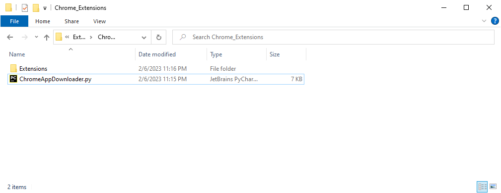
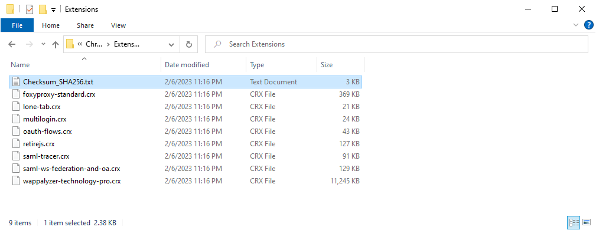
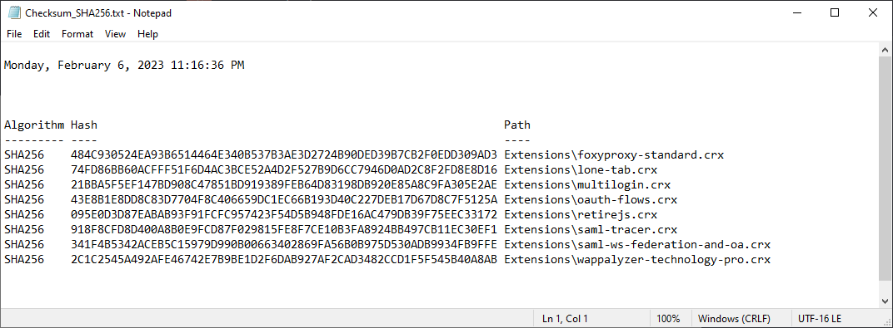

# Chrome Extensions for offline web browsers

This repo is created to download the latest Google chrome extensions for offline installation.

## ⚠️ DISCLAIMER & WARNING

**IMPORTANT: READ BEFORE USING THIS REPOSITORY**

This repository is a **personal collection and aggregation** of various tools, scripts, and extensions for convenience and easy access. **I DO NOT own, create, or claim any rights to the contents of this repository.**

### Copyright & Ownership
- All tools, scripts, and extensions in this repository belong to their **original authors and copyright holders**
- I make **NO COPYRIGHT CLAIMS** to any of the content
- All original licenses, terms, and conditions of each tool **remain in effect**
- This is purely a **curatorial collection** for personal use and reference

### No Warranty & Liability Disclaimer
- I provide **NO WARRANTY, EXPRESS OR IMPLIED** for any tools or scripts
- I accept **NO RESPONSIBILITY OR LIABILITY** for:
  - Any damage, data loss, or system issues caused by these tools
  - Legal consequences from using these tools
  - Accuracy, functionality, or security of any included software
  - Compliance with local laws or regulations

### User Responsibilities
- **YOU USE THESE TOOLS AT YOUR OWN RISK**
- Verify the legitimacy and safety of all tools before use
- Ensure compliance with applicable laws and regulations
- Respect the original licenses and terms of each tool
- Download directly from official sources when possible

### Legal Use Only
These tools are intended for **authorized security testing, research, and educational purposes only**. Unauthorized use against systems you don't own or lack permission to test is **illegal and unethical**.

**By downloading or using anything from this repository, you acknowledge that you have read, understood, and agreed to this disclaimer.**

## Update: 
The script is  not working anymore but there in extension that is useful to get the extensions: https://chromewebstore.google.com/detail/get-crx/dijpllakibenlejkbajahncialkbdkjc

### Use case:
Imagine a scenario where you need to install your chrome extension on a web browser that doesn't have any internet connection.

### Requirements: 
This script use python3

### Credits: 
https://gist.github.com/luizoti/20e41bb0ea30f2ce0170b657e1238499


### Usage:


1.Run the python file to download the extensions
```
python3 ChromeAppDownloader.py
```

2.Run the following PS command in **command prompt** and generate the **_Checksum_SHA256.txt_**

_Command for table format:_
```
powershell -command "Get-Date | Tee-Object -Append -FilePath Checksum_SHA256.txt; Get-FileHash Extensions\* | Select-Object -Property Algorithm, Hash, @{n='Path'; e={$_.Path.Substring(($PWD).Path.Length + 1)}} | Format-Table | Tee-Object -Append -FilePath Checksum_SHA256.txt"
```
**or**

_Command for list format:_

```
powershell -command "Get-Date | Tee-Object -Append -FilePath Checksum_SHA256.txt; Get-FileHash Extensions\* | Select-Object -Property Algorithm, Hash, @{n='Path'; e={$_.Path.Substring(($PWD).Path.Length + 1)}} | Format-List -Property Path, Hash, Algorithm | Tee-Object -Append -FilePath Checksum_SHA256.txt"

```
3.Move the **_Checksum_SHA256.txt_** to **_Extensions/_** folder
```
move /Y Checksum_SHA256.txt Extensions\
```

### Screenshots:

**Screenshot-1:** Before executing the commands
<kbd></kbd>

**Screenshot-2:** Above 3 commands executed in windows command prompt
<kbd></kbd>

**Screenshot-3:** After executing the commands
<kbd></kbd>

**Screenshot-4** List of downloaded extensions
<kbd></kbd>

**Screenshot-5** Output of _Checksum_SHA256.txt_ file
<kbd></kbd>
